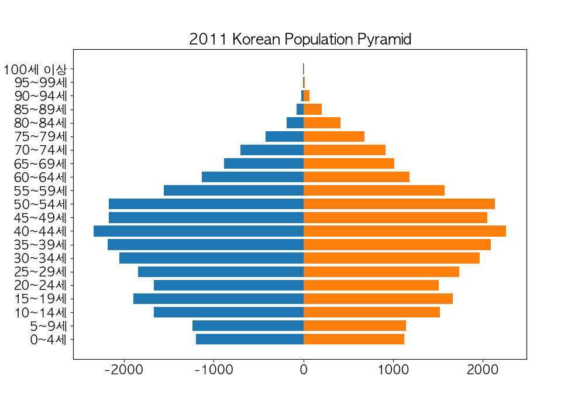
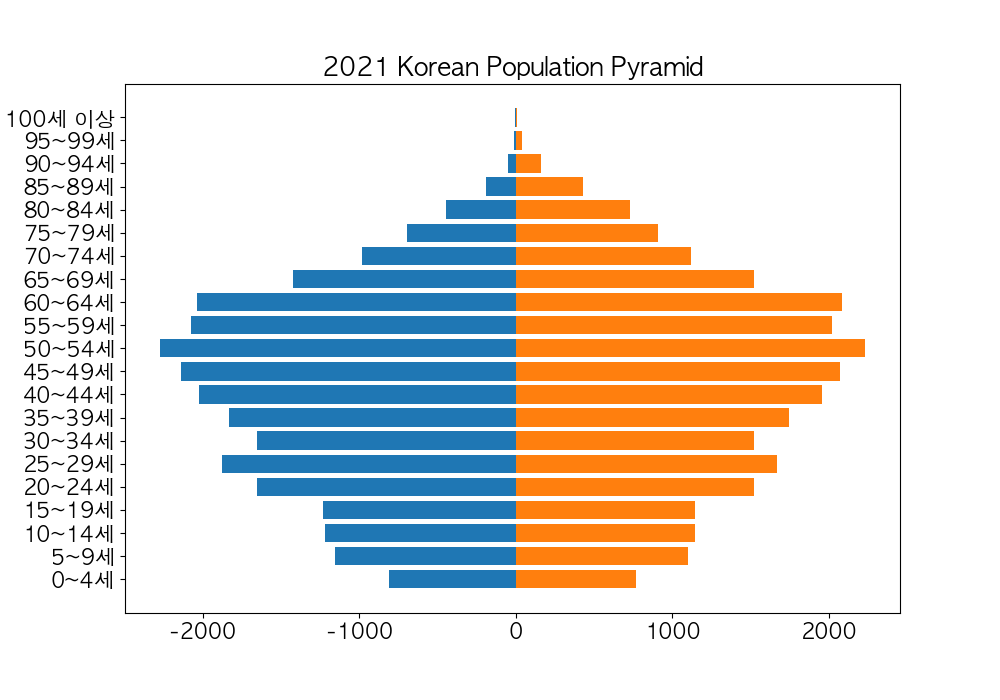

# Population_Data_Visualization

Visualizing Korean population data using different python libraries such as pandas, matplotlib, etc.

## Korean Population in 2011

-   Male in blue and Female in orange
    

## Korean Population in 2021

-   Similar distribution as 2011
-   Colors for the gender are the same
    

## Number of Births and Total Birth Rate from 2012 to 2020

